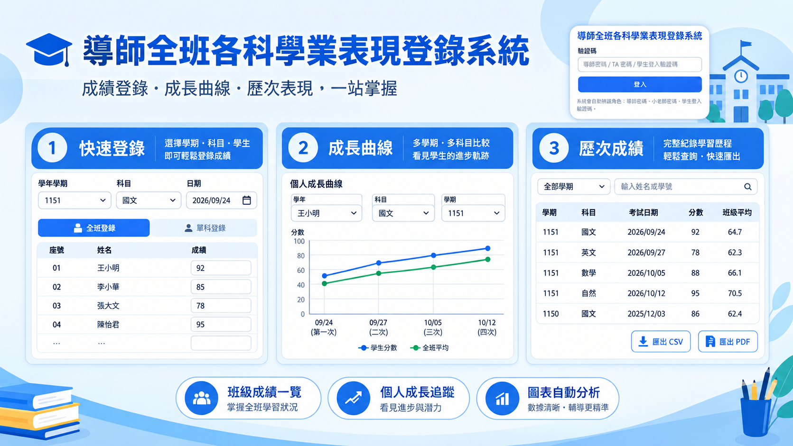

# 導師全班各科學業表現登錄系統

導師建學期與匯入名單、各科小老師登錄本科成績、學生與家長查詢個人成績與成長曲線。
以 **Google Apps Script 網頁應用程式 + Google Sheets** 建置，免伺服器、免資料庫、免網域。

- 規格書：`LearningPerformance_CodeArtifact.md`
- 實作計畫與決策紀錄：`PLAN.md`（含 D1–D29 決策、B1–B10 缺陷紀錄、§9 各里程碑驗收紀錄）
- 程式碼：`src/`

---

## 1. 系統概覽

| 角色 | 登入方式 | 功能 |
| :-- | :-- | :-- |
| **導師** | 腳本屬性 `ADMIN_PASSWORD` | 學期 / TA 密碼、學生資料匯入、成績登記、綜合查詢與 CSV/PDF 匯出、成長曲線圖（個人＋全班） |
| **小老師** | `Semester_TA_List` 的 `TA_Password` | 本科成績登錄（**鎖學期、鎖科目**） |
| **學生 / 家長** | `Students` 的 `Auth_Code` | 歷次成績明細、個人成長曲線圖 |

**技術堆疊**

| 層 | 使用 |
| :-- | :-- |
| 後端 | Google Apps Script（V8，`src/*.gs`），單一 API 入口 `api(action, payload)` |
| 資料 | Google Sheets（`LearningPerformance_資料庫`，3 張工作表） |
| 前端 | Tailwind CSS 3.4.16、Chart.js 4.4.1、html2canvas 1.4.1、jsPDF 2.5.1（皆由 CDN 載入） |
| 本機開發 | clasp（`rootDir: src`） |

---

## 2. 部署（從零到上線）

### 2.1 前置需求

- Node.js 與 npm
- 一個 Google 帳號（建議使用學校的 Google Workspace 帳號）
- 終端機

```bash
npm install -g @google/clasp
clasp login
```

### 2.2 取得 Apps Script 專案

**沿用本專案既有的腳本（`scriptId` 已寫在 `.clasp.json`）**

```bash
clasp open        # 在瀏覽器開啟 Apps Script 編輯器
```

**或建立一個全新的專案**

```bash
clasp create-script --type standalone --title "導師全班各科學業表現登錄系統"
```

> 執行後會產生新的 `.clasp.json`（含新的 `scriptId`）。`rootDir` 請設為 `"src"`。
> 本專案的 `.clasp.json` 內容：

```json
{
  "scriptId": "你的腳本 ID",
  "rootDir": "src",
  "scriptExtensions": [".js", ".gs"],
  "htmlExtensions": [".html"],
  "jsonExtensions": [".json"]
}
```

### 2.3 推送程式碼

```bash
clasp push -f
```

`-f` 表示跳過版本確認。看到 `Pushed N files` 即完成（網路慢時可能逾時但實際已成功，可再執行一次）。

### 2.4 設定腳本屬性

在 Apps Script 編輯器：**專案設定（左側齒輪）→ 腳本屬性 → 編輯腳本屬性**

| 鍵 | 值 | 說明 |
| :-- | :-- | :-- |
| `ADMIN_PASSWORD` | 你選的導師密碼（**至少 6 碼**） | 建議 12 碼以上且含英文與數字 |
| `SPREADSHEET_ID` | *可留空* | 留空時首次執行 `initSystem()` 會自動建立試算表並寫入 |

> ⚠️ **更換導師密碼請一律改這裡**，不要改程式碼。
> M7 之後 `setAdminPassword` 已改為私有函式，無法從網頁呼叫（原因見 §7）。

### 2.5 初始化資料表（只需執行一次）

在編輯器上方的函式下拉選單選 **`initSystem`** → 按「執行」→ 同意授權。

完成後打開 **檢視 → 執行記錄**，會看到：

```
✅ 初始化完成
試算表 ID：1AbC...
試算表網址：https://docs.google.com/spreadsheets/d/1AbC...
工作表：Semester_TA_List / Students / Grades
🔑 導師密碼：已存在（未顯示）
```

`initSystem()` 是**冪等**的，重複執行不會破壞資料，可隨時再跑一次確認狀態。

### 2.6 部署為網頁應用程式

編輯器右上角 **部署 → 新增部署**：

| 設定 | 值 |
| :-- | :-- |
| 類型 | **網頁應用程式** |
| 說明 | （隨意，例如 `v1`） |
| 執行身分 | **我** |
| 存取權 | **所有人** |

按「部署」→ 複製產生的網址（`https://script.google.com/macros/s/.../exec`），這個網址就是師生使用的入口。

> `src/appsscript.json` 刻意保持精簡，**存取權「所有人」是在此處設定**，不在程式碼裡。

### 2.7 更新程式碼（之後每次修改都要）

```bash
clasp push -f
```

然後在編輯器：**部署 → 管理部署 → 找到現有的網頁應用程式 → 按鉛筆（編輯）→ 版本選「**Head deployment**」→ 部署**。

- 選 **Head deployment**：以後 `clasp push` 的新程式碼會自動生效，不需再重複這步驟。
- 若版本選的是**固定版本號**，每次 push 都必須重做這步驟，且請**沿用同一個部署**，不要新增部署（否則會多出一堆舊網址）。

### 2.8 驗證部署

1. 編輯器執行 **`scanCorruptedRows()`** → 應顯示「✅ 三張表皆未發現受損列」
2. 開啟 `/exec` 網址 → 用 `ADMIN_PASSWORD` 登入 → 應看到 5 個分頁
3. 導師建立學期、匯入學生、登錄幾筆成績，再用小老師密碼與學生驗證碼各登入一次

---

## 3. 使用手冊

### 3.1 導師

登入後有 5 個分頁：

**① 學期 / TA 密碼**

1. `學年學期` 輸入 4 碼（例 `1151`＝115 學年第 1 學期）
2. `科目清單` 每行一科，格式「代碼, 中文名稱」，例：
   ```
   Chi, 國文
   Eng, 英文
   Math, 數學
   ```
   系統預填 8 科，可增刪（上限 50 科；代碼須英文字母開頭，1–16 碼）
3. 按「建立 / 更新學期」

- 每科會產生一組 **4 碼小寫英數 TA 密碼**（已剔除易混淆的 `0 o l 1 i`），畫面上可直接複製給各科小老師
- **修改科目清單時**：清單上沒有但資料庫裡有的科目會被刪除，系統會列出受影響科目並要求二次確認，**該科成績會一併刪除**
- 同一個 `代碼` 改中文名稱＝改名（成績保留）

**② 學生資料匯入**

貼上 CSV（**免標頭、四欄**），每行：

```
座號, 學號, 姓名, 登入驗證碼
```

範例（`G11.csv` 即為範本）：

```
1,11510001,王小明,a3k9
2,11510002,陳美華,b7p2
```

- 支援全形逗號自動轉半形、CRLF、BOM
- **以 `學年學期 + 學號` 為唯一鍵**：重複匯入＝覆蓋更新（同人換驗證碼、換座號）
- 驗證失敗會逐列回報錯誤，不會寫入任何資料

**③ 成績登記**

1. 選學年學期 → 選科目 → 選日期 → 選場次（或按「新增場次」輸入日期）
2. **考試範圍可以留白**；同科同日期同範圍＝同一場次
3. 在格子裡輸入分數（**僅接受 0–100 整數**）；留空＝缺考
4. 按「儲存本次成績」

儲存採 **diff 模式**：只寫入有變動的列，全欄留空＝刪除該筆成績，完全沒動＝不碰試算表。
儲存後會顯示「新增 / 更新 / 刪除」筆數，並回傳寫入後重新讀取的權威資料。

**④ 綜合查詢 / 匯出**

- 三個條件可任意組合（皆可留空）：`學年學期`＋`學號 / 姓名關鍵字`＋`科目`
- 內建**整頁 CSV 與 PDF 匯出**（匯出的是**整個查詢結果**，不限於當前頁面）

**⑤ 成長曲線圖**

- **個人模式**：選學生 → 各科各一張圖
- **全班模式**：必須先選**單一科目** → 每位學生各一張子圖（座號升冪）
- 圖例：**綠線＝全班平均**、**藍點/線＝高於班平均**、**紅點/線＝低於班平均**
- Y 軸固定 0–100；點一下「學年學期」可切換學期

### 3.2 小老師

- 使用導師給的 **4 碼 TA 密碼**登入（密碼本身即綁定學期與科目，不需另選）
- 只會看到「本科成績登錄」一個分頁
- **後端強制**：只能讀寫自己的學期、自己的科目，指定他科一律拒絕

### 3.3 學生 / 家長

- 使用 CSV 第 4 欄的**登入驗證碼**登入
- 兩個分頁：
  - **歷次成績**：只看得到**自己**的成績（後端強制 `studentId = 自己`，關鍵字被忽略）
  - **成長曲線圖**：只有「學年學期」一個條件，各科個人曲線
- 跨學期：若同一學號＋姓名登錄在其他學期，下拉選單會自動出現那些學期

---

## 4. 資料表結構

試算表：`LearningPerformance_資料庫`（由 `getSS_()` 自動建立，ID 存在 `SPREADSHEET_ID`）

| 工作表 | 欄位 |
| :-- | :-- |
| `Semester_TA_List` | `Ysem`、`Subject`（複合碼如 `1151_Chi`）、`Subject_NA`、`TA_Password` |
| `Students` | `Ysem`、`Seat_No`、`Student_ID`、`Name`、`Auth_Code` |
| `Grades` | `Ysem`、`Seat_No`、`Student_ID`、`Name`、`Subject`、`Exam_Date`、`Score`、`Exam_Scope` |

- **第 1 列固定為標頭**，請勿更動或插入列
- `Ysem`、`Student_ID`、`Exam_Date` 以**文字**格式儲存（避免 `1151` 變 `1151.0`、日期被轉型）
- **成績唯一鍵**：`Ysem + Subject + Exam_Date + Exam_Scope + Student_ID`
- **場次唯一鍵**：`Subject + Exam_Date + Exam_Scope`

> 直接用試算表檢視資料是安全的：**試算表本身沒有分享給任何人**，只有擁有者能開；網頁應用程式不對外暴露試算表網址。

---

## 5. 常見問題

| 問題 | 解答 |
| :-- | :-- |
| 忘記導師密碼 | 編輯器 → **專案設定 → 腳本屬性 → 編輯 `ADMIN_PASSWORD`** |
| 提示「尚未設定導師密碼」 | 同上，先把 `ADMIN_PASSWORD` 設好再登入 |
| 學生看不到某學期 | 該學期的 `Students` 必須有「**學號 + 姓名皆相同**」的列 |
| 小老師無法存檔 | 確認他用的是**自己科目**的 TA 密碼；密碼綁定學期，跨學期不可寫 |
| 分數打不進去 | 只接受 **0–100 的整數**，小數與負數會被拒絕 |
| 儲存後資料看起來沒動 | 這是預期行為：採 diff 寫入，零變動＝完全不寫試算表 |
| 成績格變空白 | 該筆成績已被「清空＝刪除」；或用 `scanCorruptedRows()` 掃描受損列 |
| 更新了程式碼但沒生效 | `clasp push` 後仍需 **部署 → 管理部署 → 編輯 → 版本選 Head deployment** |
| CSV / PDF 匯不出來 | 匯出功能依賴 CDN（html2canvas、jsPDF），**瀏覽器需能連外** |
| 視窗縮放後圖表尺寸怪 | 切換分頁會自動重建圖表；仍異常時重新整理頁面 |
| 執行時數不足 | Google 免費帳號每日有執行配額；本系統每次請求都會重讀試算表，屬正常消耗 |

---

## 6. 系統維護

### 6.1 掃描受損資料列

在編輯器執行 **`scanCorruptedRows()`**（唯讀，不修改資料）。

它會檢查三張表有沒有「整列 8 欄被填成同一個值」的異常列（歷史上曾因 `setValue()` 誤用而產生）。
若有，會把**完整清單印在執行記錄**，回傳值只給筆數。

處理方式：

| 表 | 處理 |
| :-- | :-- |
| `Grades` | 刪除該列 → 到「成績登記」重新登錄 |
| `Students` | 刪除該列 → 重新貼上該學期 CSV |
| `Semester_TA_List` | 刪除該列 → 重新執行該學期的科目建立 |

### 6.2 變更三角色的權限規則

規則集中在 `src/Auth.gs` 與 `src/Code.gs`：

- `assertRole_(ctx, roles)`：角色層（能不能呼叫這個 action）
- `assertExamAccess_(ctx, ysem, code)`：成績讀寫層（小老師鎖科鎖學期）
- `assertSubjectScope_(ctx, ysem, subject)`：查詢與圖表層（導師全班／小老師本科／學生本人）
- `studentMayReadYsem_(ctx, ysem)`：學生可讀學期判準

**修改權限時務必同步檢查這四個函式**，它們是唯一的閘道。

---

## 7. 安全性說明

### 7.1 三層閘道

```
請求 → api()
        ├─ 1. token 驗證      requireAuth_()（CacheService，TTL 4 小時，滑動延長）
        ├─ 2. 角色授權        assertRole_(ctx, roles)   ← 分發表 Code.gs dispatch_
        └─ 3. 資料範圍        assertExamAccess_ / assertSubjectScope_ / studentMayReadYsem_
```

`login` 是唯一免 token 的 action；其餘一律先驗證再分發。

### 7.2 `google.script.run` 攻擊面（M7 稽核重點）

**Google 官方文件明定：`google.script.run` 可以直呼任何「公開的頂層函式」**，只有**尾碼 `_` 的私有函式**對客戶端完全隱形且不可呼叫。
這代表任何訪客都能在瀏覽器按 F12 打開開發人員工具，繞過 `api()` 直接執行伺服器函式。

本專案的處置（詳見 `PLAN.md` §9.8【M7-1】）：

| 函式 | 處置 |
| :-- | :-- |
| `setAdminPassword` | **改為私有 `setAdminPassword_`**。更換密碼改用「專案設定 → 腳本屬性」 |
| `include` / `defaultSubjectsText` | **改為私有**（只在伺服器端模板執行，本無須公開） |
| `initSystem` / `scanCorruptedRows` | 保留公開（編輯器下拉選單**無法執行私有函式**），但**機密與明細只寫入 `console.log`**，回傳值改為不含機密的摘要 |
| `doGet` / `api` | 唯二預期的公開函式，`api` 內建 token + 角色 + 資料範圍三層閘道 |

> 結論：**任何新增的伺服器端函式，若非刻意要給網頁呼叫，一律加尾碼 `_`。**
> 若必須公開（例如要在編輯器下拉選單執行），**回傳值不得包含任何機密**，機密一律走 `console.log`（只有執行記錄看得到）。

### 7.3 已知殘餘風險

| 風險 | 說明 | 建議 |
| :-- | :-- | :-- |
| **登入無節流** | `login` 沒有失敗次數限制。全域鎖定會讓任何學生都能用 50 次失敗把整班登入癱瘓（**DoS 比暴力嘗試更嚴重**），逐碼鎖定又擋不住枚舉，故刻意不實作 | 導師密碼請設 **12 碼以上**；學生驗證碼避免用座號、學號、生日等可猜字串；GAS 每日配額天然限制了嘗試總量 |
| **Token 明文存 CacheService** | 4 小時有效期，滑動延長 | 登出即失效；更換導師密碼**不會**使既有 token 失效，必要時請用「重新整理 + 登出」 |
| **試算表擁有者即最高權限** | 程式以「我」的身分執行，Sheet 權限等同擁有者 | 不要把試算表分享給其他人編輯 |

### 7.4 錯誤訊息

- `api()` **一律不回傳堆疊**，只回使用者可讀訊息
- `TypeError` / `ReferenceError` / `SyntaxError`（程式缺陷）一律替換為通用文案，不透露內部結構
- `doGet` 模板失敗時回傳友善錯誤頁，堆疊只寫入執行記錄
- 前端 `rpc()` 把 `msg` 顯示在畫面或 toast，不會靜默失敗

---

## 8. 本地開發（選購）

```bash
clasp open-logs      # 開啟執行記錄
clasp push -f        # 推送 src/ 下所有 .gs / .html / appsscript.json
clasp pull           # 從雲端抓回
```

**語法檢查**（無需連線）：把 `.gs` 複製成 `.js` 後 `node --check`，HTML 用正則抽出 `<script>` 區塊再檢查。

注意：

- 讀寫含中文的 HTML 檔時，PowerShell 請加 `-Encoding UTF8`，否則會亂碼
- 專案根目錄的 `.clasp.json.bak` 是備份檔，可直接刪除
- `clasp push` 可能逾時但實際成功，重跑一次即可

---

## 9. 檔案結構

```
LearningPerformance/
├── .clasp.json                     # scriptId + rootDir: src
├── PLAN.md                         # 實作計畫、決策 D1–D29、里程碑驗收紀錄
├── README.md                       # 本檔
├── LearningPerformance_CodeArtifact.md   # 原始規格書
├── G11.csv                         # 學生匯入範本（四欄、免標頭）
└── src/
    ├── appsscript.json             # Asia/Taipei、V8、精簡版（存取權在部署設定）
    ├── Code.gs                     # doGet、include_()、api() 單一入口與 dispatch_
    ├── Auth.gs                     # 登入、token、權限閘道（assertRole_ / assertSubjectScope_）
    ├── Storage.gs                  # 試算表讀寫、文字格式、寫入鎖
    ├── Setup.gs                    # 科目解析、學期/TA 密碼、initSystem、scanCorruptedRows
    ├── Students.gs                 # 學生 CSV 解析與匯入、名單讀取
    ├── Grades.gs                   # 場次與成績讀寫、diff 存檔、assertExamAccess_
    ├── Query.gs                    # 綜合查詢
    ├── Chart.gs                    # 成長曲線資料組裝
    ├── Index.html                  # 頁面骨架、CDN、include_ 順序
    ├── Styles.html                 # 配色、卡片、表格樣式
    ├── Common.html                 # rpc、分頁、匯出 CSV/PDF、登入流程
    ├── AdminView.html              # 導師 5 個分頁
    ├── TAView.html                 # 小老師 1 個分頁
    ├── StudentView.html            # 學生 2 個分頁
    ├── GradesEntry.html            # 成績登錄編輯器（導師／小老師共用）
    ├── QueryView.html              # 綜合查詢（導師／學生共用）
    └── ChartView.html              # 成長曲線（導師／學生共用）
```

---

## 10. API 一覽

單一入口 `api(action, payload)`，回傳固定為 `{ ok: true, data }` 或 `{ ok: false, msg }`。

| action | 權限 | 主要參數 | 回傳 |
| :-- | :-- | :-- | :-- |
| `login` | **公開** | `code` | `token` + `profile` |
| `logout` | 已登入 | `token` | `done` |
| `bootstrap` | 任意登入者 | `token` | `profile` + 可見學期清單 |
| `createSemester` | 導師 | `ysem, subjectsText, confirmDelete?` | 建立結果 或 `needConfirm + deletions[]` |
| `listSemesters` | 導師 | `token` | 全部學期科目密碼 |
| `getRoster` | 導師 / 小老師 | `ysem` | 座號序名單 |
| `importStudents` | 導師 | `ysem, csvText` | `errors[]` 或 `parsed/created/updated/roster` |
| `listExams` | 導師 / 小老師 | `ysem, subject` | 該科既有場次 |
| `getExam` | 導師 / 小老師 | `ysem, subject, examDate, examScope` | 該場次全班成績 |
| `saveExam` | 導師 / 小老師 | `ysem, subject, examDate, examScope, scores` | diff 統計 + 重讀的權威資料 |
| `query` | 全部 | `ysem, subject?, studentKeyword?, studentId?` | 列資料 + 科目清單 |
| `chartData` | 全部 | `ysem, mode?, subject?, studentId?` | 圖表資料 + `subjectList` + `roster` |
